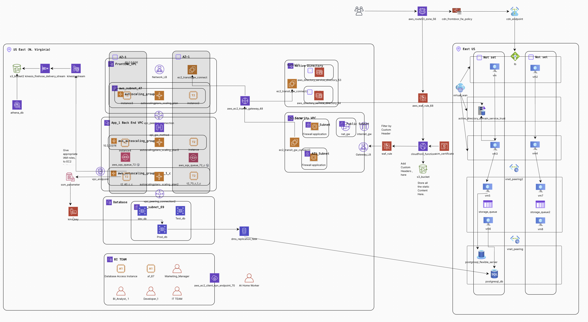
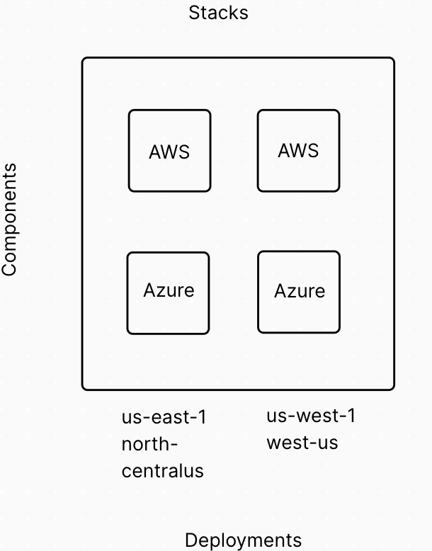
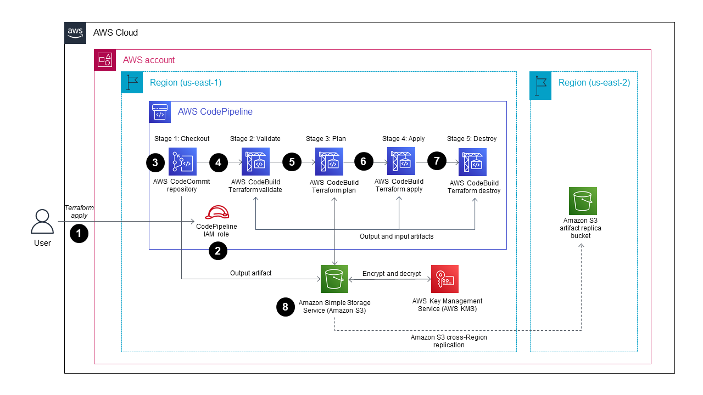
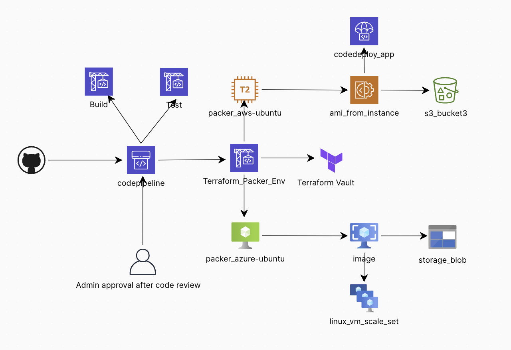
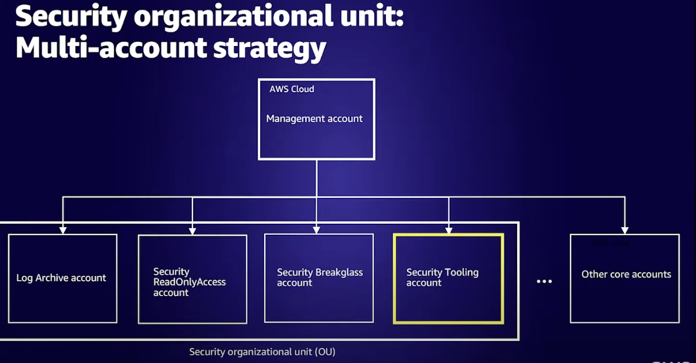
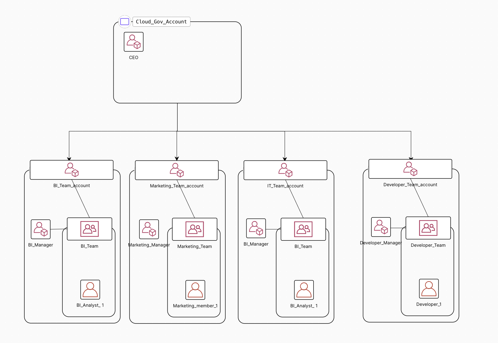
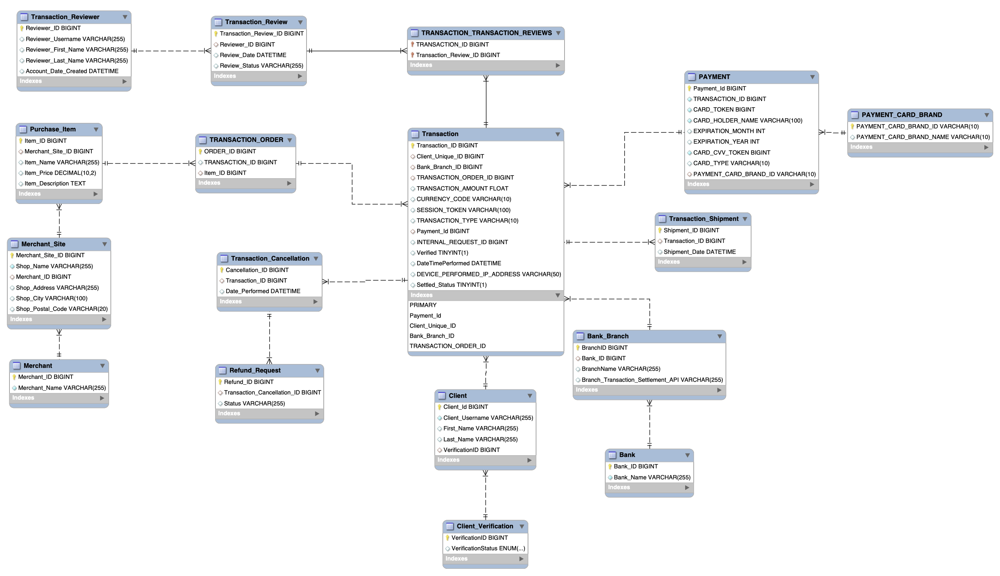

## Description

A cloud solution for a subset of government organization, created using NSA and CISA  Top 10 Cybersecurity Mitigation Strategies. This cloud Solution can act as a template to manage their overall cloud infrastructure , and expand their network to allow for additional apps in the future. By providing seamless , and easy integration to their current secure infrastructure.

The solution has been optimized for Operational Excellence , Security , Reliability , Performance , Cost Optimization. It has also been made sure to meet the Impact level 4 requirements as per [Department of  Defense (DOD) IL-4 Guidelines](./docs/DOD_IL_Requirements.pdf) from DISA, [NSA Top 10 Security Strategy](./docs/NSA_Top10_Security_Strategy.pdf), and [OWASP Top 10 Security Risks](https://owasp.org/www-project-top-ten/).

**Side Note:** This project is not intended as a shippable product, but rather as a proof of concept. It does not meet many quality standards. For example, many security groups are misconfigured, and IAM role policies are incorrectly configured. Although inter-VPC connectivity has been tested, health checks have not yet been implemented, and it has not been tested for throughput. The code is written in a way that allows others to use it as a template to build more solutions. Many components of the project have been left in a future-configurable state. This project aims to showcase my skills in networking, Requirments Engineering,  AWS architecture building, Multi Cloud Architecture Skills, as well as my understanding of the AWS product suite and how I would use Terraform to build a cloud architecture solution. None of the Terraform code has been tested yet, but I would suggest looking at the project board to see what I intend to complete going forward. I have incorporated SNYK and Checkmarx as part of my development CI/CD to help enforce code quality and security standards. The CI/CD pipeline has also not been tested, but I have tried to ensure that the code for the pipeline is correct. I intend to finish this project as my time allows me, and believe it will still take an another year to meet the right standards.

**Upcoming Changes** : https://github.com/users/arshappleid/projects/4

## Repo Design

```
.
├── docs 									# Project Documentation
│ ├── closing_presentation.pptx 			# Close off Presentation
│ ├── procurement_request 					# Initial project request
│ ├── requirements.docx 					# Project Requirements
│ └── ...
├── cicd_for_iac 							# AWS Codepipeline Config.
├── iam_role 								# Config for IAM roles 
├── iac 									# Terraform Config modules
│	├── aws									# AWS Config Modules
│	├── azure								# Azure Config Modules
├── packer_config							# Packer Provisoner code , to create Images.
├── integration_tests						# Integration Testing with GO
├── database.sql 							# Potential Schema Design
└── README.md

```

## Requirements Overview:

- Multi AZ Availability for high Availability.
- Multi VPC Structure to design a cohesive Infrastructure , for future projects to be able to scale.
- Auto recovery from failure, with very little downtime. Less than 5 minutes.
- Appropriate Logging at individual VPC level.
- There can be upto 100000 concurrent users of the application , at one time during peak hours. Should have high Scaling capacity , to endure high number of User Requests.
- Application should have access from all states of America, with very low latecy. Although , should only be deployed close to MD , for security purposes.
  - Occasionally people might also access it from other parts of the world, and should have access to the application with low latency as well.
- Deploy, plan to maintain and rotate SSL certificates on Endpoints using AWS Ceritificate Manager.
- Document all security compliance rules through AWS Config.

## Department of Defense Impact Level 4 Requirements

- Support for PKI authentication by DID priveleged and non priveleged users.
- Support for DOD IP Addressing.
- Encryption of Data at Rest
- Cloud Solution (CSO) must be able to function if DOD limits access to or disconnects from the internet during times of attack.
- Any access to internet from the CSO , must be through a `<u>`specific Internet Line `</u>`.
- Prevent any backdoor access from the internet, and any traffic to the internet should be monitored.

### Security Risks Identified and accounted for

- Broken Access Control / In efficient Access Control - Seperate AD VPC .
- Secure Infrastructure Design - Implementing aws secure architecture design.
- Security Logging and Monitoring - Cloud Watch Alarms , and Logs Recording.
- Cryptographic Key Failures - Automatic key rotation

### System Design Choices Implemented

* Caching - CDN Caching through Cloudfront , Cache Aside (S3 bucket), Write Behind (FIFO Que).
* Performance - Increase MTU Size for Packets , Create a gateway Endpoint for S3 bucket to be accessed inside the network.
* Database Caching - Aurora Buffer pool, connection pooling.
* High Availability - Multi-AZ deployment , Que - Based Load Leveling , Database Connection pool.
* Resiliency - Backup Solution (Azure Backup Solution), Retry, Health Endpoint Monitoring.
* Monitoring - Health , Availability , Performance , Security , Usage , Alerts.
* Security - Gatekeepr VPC , Federated Identity (Microsoft AD) , Network Segmentation.

## Multi Cloud Strategy

- PKI keys are provisioned using Terraform Vault , as this gave the oppurtunity to provision the keys in the multi cloud infrastructure.
- Container Images Will be built using [Terraform](https://developer.hashicorp.com/terraform/tutorials/provision/packer) , which can be consumed as part of a CICD pipelines.
  - Since this gives the developer , to do development in Docker Env. which can later be converted to Amazon AMI , and Azure VM Images.

## Maintenance after Deployment

- Rotate passwords every n days , for users accessing cloud resources.
  - Continue with 2 MFA Account login , for users.
- Analyze Cloudwatch Logs , to look for any malicious activity.
- Respond to SNS notifications, regarding any changes in cloud infrastructure.

## Important Links:

- [Original Procurement Document Request](./docs/procurement_request.pdf)
- [Functional &amp; Non Functional Requirements](./docs/requirements.docx)
- [Project Board](https://github.com/users/arshappleid/projects/4/views/1)

## Latest Architecture Design



### Multi Region Strategy using Terraform Stacks



## IAC CICD Pipeline



Side Note : We will be using Github Repository , with a Code Star Connection instead of Code Commit. Although Rest of the Pipeline stays the same. Also Github Actions will provide additional functionality to perform code checks, and Linting, while the code is being developed. Although only code pipeline will have the ability / AWS Secrets to deploy the architecture.

### Developer CICD Pipeline



## IAM Infrastructure

### Infrastructure Management Accounts



### Team Management Accounts



## Threat Detection, Monitoring and response , after Deployment

1. Through Security Hub:
   1. Respond to AWS [Guard Duty](https://aws.amazon.com/guardduty/) EMAIL notifications.
      1. Will notify regarding : Unusual API calls, or unauthorized deployments.
      2. VPC Logs , DNS Logs , CloudTrail Events.
   2. AWS Macie Notifications regarding AWS Account Best Practices.
   3. Inspector - Any security issues from AMI Images.
2. Analyze network logs Dashboards, to understand and lookup any unauthorized access.
3. Monitor Account Access through AWS Control Tower.
4. Follow , and make changes if Trusted Advisor advices of any more best practices.
5. Provision SSM Parameters through [Terraform Vault](https://registry.terraform.io/providers/hashicorp/vault/latest/docs).

## Proposed Database Schema Design



### Sources Reffered

1. [AWS Documentation to create a CICD Pipeline for Terraform Code](https://docs.aws.amazon.com/prescriptive-guidance/latest/patterns/create-a-ci-cd-pipeline-to-validate-terraform-configurations-by-using-aws-codepipeline.html)
2. [Terraform VPC Module](https://registry.terraform.io/modules/terraform-aws-modules/vpc/aws/5.7.1) By Anton Babenko
3. [Terraform S3 Module](https://registry.terraform.io/modules/terraform-aws-modules/s3-bucket/aws/latest) By Anton Babenko
4. [Terraform TGW Module](https://registry.terraform.io/modules/terraform-aws-modules/transit-gateway/aws/latest) By Anton Babenko
5. [Terraform ASG Module](https://registry.terraform.io/modules/terraform-aws-modules/autoscaling/aws/2.0.0)
6. [Terraform Stacks](https://github.com/hashicorp-guides/lambda-component-expansion-stack) 
