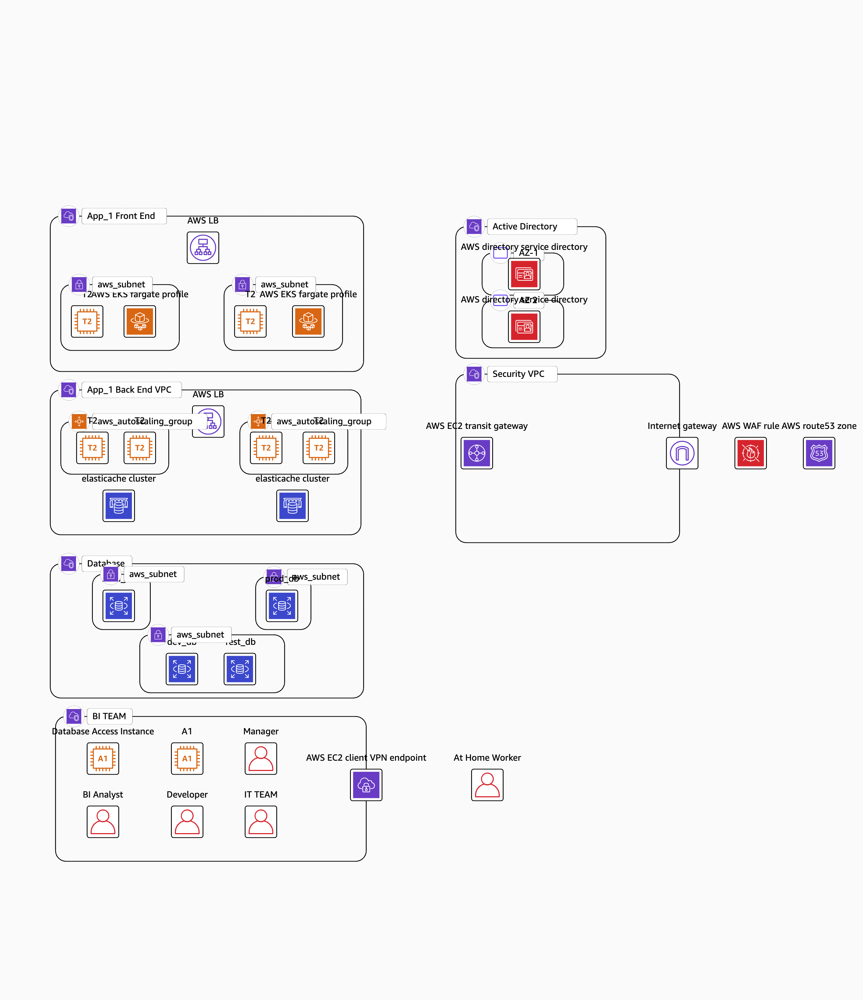
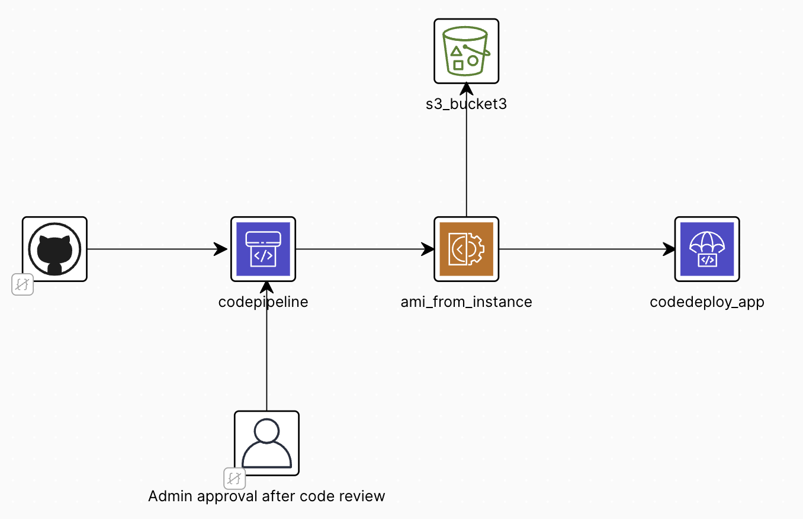
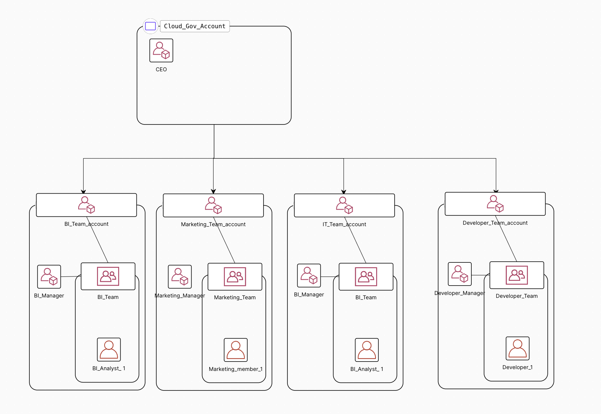
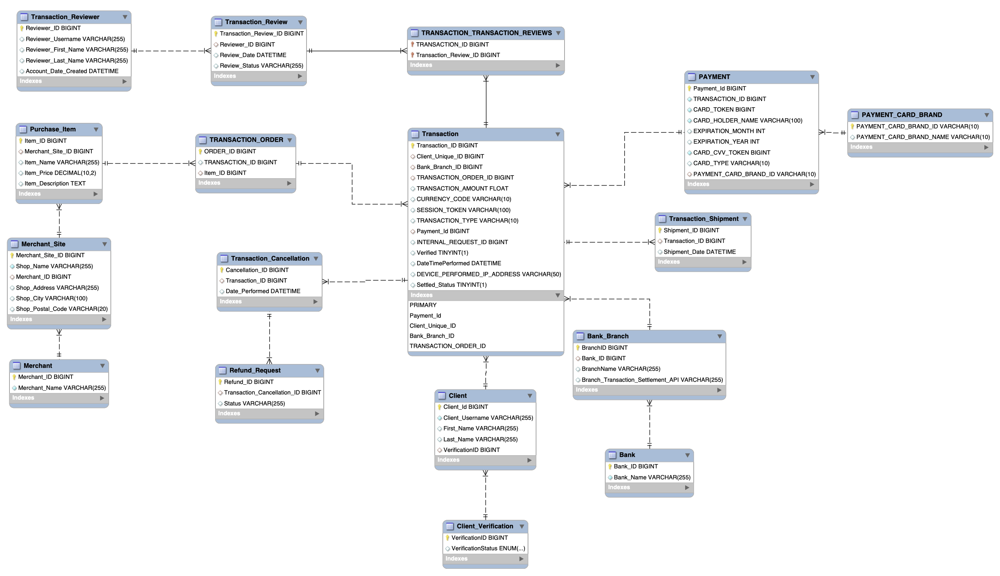

## Description

A cloud solution for a subset of government organization , that has multiple workflow apps deployed to manage day to day management tasks and relay valuable information to people. This cloud Solution can act as a template to manage their overall cloud infrastructure , and expand their network to allow for additional apps in the future. By providing seamless , and easy integration to their current secure infrastructure.

The solution has been optimized for Operational Excellence , Security , Reliability , Performance , Cost Optimization. While also taking into Governance practices into account.

## Repo Design

```
.
├── docs # All the Documentation files are in this folder
│ ├── closing_presentation.pptx # Small Presentation with an overview of project
│ ├── procurement_request # Initial project request , highlighting high-level requirements of the project.
│ ├── requirements.docx # Final requirements for the project.
│ └── ...
├── iam_role # All the code related to setting up authentication. 
├── infrastructure_As_Code # All the code for different resources in the solution , organized by VPC names.
├── database.sql # Potential Schema design for an application
└── README.md

```

## Requirements Overview:

- Multi AZ Availability for high Availability.
- Multi VPC Structure to design a cohesive Infrastructure , for future projects to be able to scale.
- Auto recovery from failure, with very little downtime. Less than 5 minutes.
- Appropriate Logging at individual VPC level.
- There can be upto 100000 concurrent users of the application , at one time during peak hours. Should have high Scaling capacity , to endure high number of User Requests.
- Application should have access from all states of America, with very low latecy. Although , should only be deployed close to MD , for security purposes.
  - Occasionally people might also access it from other parts of the world, and should have access to the application with low latency as well.
- Deploy, plan to maintain and rotate SSL certificates on Endpoints using AWS Ceritificate Manager.
- Document all security compliance rules through AWS Config.

### Completed Checklilst

| Security VPC - Done  | IAM Infrastructure               |                                       |
| -------------------- | -------------------------------- | ------------------------------------- |
| Front End VPC - Done | Connection Testing - In Progress | MultiCloud Risk Backup Strategy       |
| Back End VPC         | Configure Environments           | Deploy developer unit for development |
| Database VPC         | Propose CICD Pipeline            |                                       |
| Active Directory VPC | Logging at VPC Level             |                                       |

### Security Risks Identified

- Broken Access Control / In efficient Access Control - Seperate AD VPC .
- Secure Infrastructure Design - Implementing aws secure architecture design.
- Security Logging and Monitoring - Cloud Watch Alarms , and Logs Recording.
- Cryptographic Key Failures - Automatic key rotation

### System Design Choices Implemented

* Caching - CDN Caching through Cloudfront , Cache Aside (S3 bucket), Write Behind (FIFO Que).
* Database Caching - Aurora Buffer pool, connection pooling.
* High Availability - Multi-AZ deployment , Que - Based Load Leveling , Database Connection pool.
* Resiliency - Backup Solution (Azure Backup Solution), Retry, Health Endpoint Monitoring.
* Monitoring - Health , Availability , Performance , Security , Usage , Alerts.
* Security - Gatekeepr VPC , Federated Identity (Microsoft AD) , Network Segmentation.

## Important Links:

- [Original Procurement Document Request](./docs/procurement_request.pdf)
- [Functional &amp; Non Functional Requirements](./docs/requirements.docx)
- [Architecture Documentation](./docs/architecture.docx)
- [Infrastructure as Code](./Infrastructure_as_Code)
- [Testing Procedure](./docs/testing_procedures.docx)

## Latest Architecture Design



## CICD Pipeline




## IAM Infrastructure



## Proposed Database Schema Design


