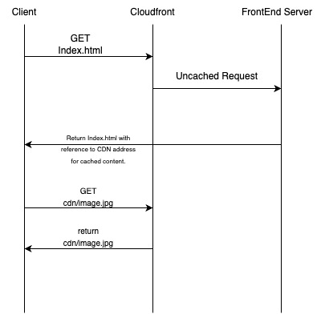

## Cloudfront caching
To allow caching of objects (Images , javascript files , pdfs) store them in ```content/immutable/*``` directory , so that they can be retrieved using ```https://appdnsname.com/content/immutable/image1.jpg``` . This will ensure that all the files in this directory are cached by cloudfront.

To utilize the cached content on a dynamic page , request the resource like this.
```html

<link rel="stylesheet" href="https://cdn.yourdomain.com/content/immutable/styles.css">
```
In the above example , if the cached content is not available at CDN distribution the application grabs it from the location where the application is hosted at. 

Read AWS [Cloudfront Testing Documentation](https://docs.aws.amazon.com/AmazonCloudFront/latest/DeveloperGuide/distribution-web-testing.html) for more examples.

### Sample HTTP request flow


## These rules have been blocked by AWS WAF

1. Cross Site Scripting
2. Any SQL Injection Attempts
3. Any Requests made from outside the US

## Environments
- prod
- stag
- dev

Only the above environment names should be used

## Logging

All the buckets utilize the ```modules/encrypted_log_bucket``` to ensure that all the logs are encrypted and stored till a compliance period. This also ensures that we use one kms key to encrypt all the logs, therefore making it easier to manage the key rotation for all the logs. 

Anyone looking to read the logs , should assume the ```iam/user_read_logs.tf``` role. Which will give it permissions to read decrypted logs of the s3 buckets.